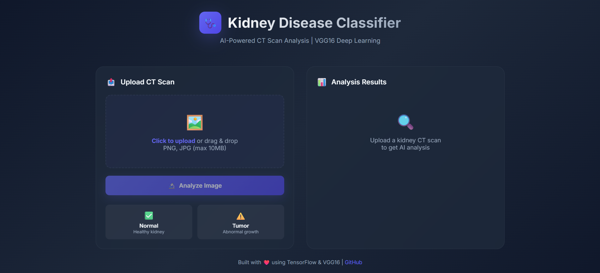
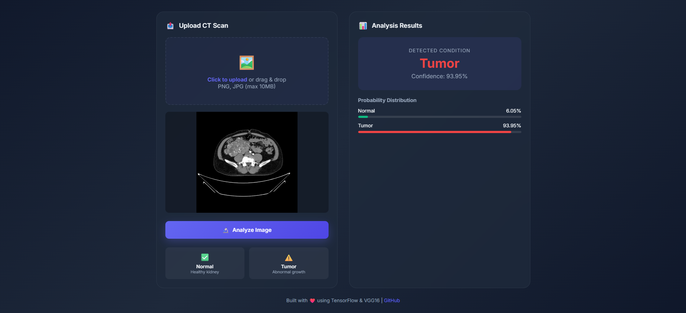

# 🩺 Kidney Disease Classification using Deep Learning

> AI-powered kidney tumor detection from CT scan images using VGG16 transfer learning with MLOps pipeline


---

## 🖼️ Screenshots



## 📋 Project Overview

This project implements an end-to-end **MLOps pipeline** for classifying kidney CT scan images as **Normal** or **Tumor** using deep learning. It features automated training pipelines, experiment tracking, and a web interface for real-time predictions.

### 🎯 Key Results

| Metric | Value |
|--------|-------|
| **Validation Accuracy** | 86.4% |
| **Validation Loss** | 0.317 |
| **Model** | VGG16 (Transfer Learning) |
| **Training Time** | ~2 hours (CPU) |

---

## ✨ Features

- 🧠 **Deep Learning**: VGG16 transfer learning with custom classification head
- 🔄 **MLOps Pipeline**: Automated 4-stage pipeline with DVC orchestration
- 📊 **Experiment Tracking**: MLflow integration for metrics and model versioning
- 🌐 **Web Interface**: Flask API with modern drag-and-drop UI
- 🎨 **Data Augmentation**: Rotation, flip, zoom, shift for better generalization

---

## 🏗️ Architecture

```
┌─────────────────────────────────────────────────────────────────┐
│                         ML PIPELINE                              │
├─────────────────────────────────────────────────────────────────┤
│                                                                  │
│  ┌──────────────┐    ┌──────────────┐    ┌──────────────┐       │
│  │    Data      │───▶│   Prepare    │───▶│   Model      │       │
│  │  Ingestion   │    │  Base Model  │    │  Training    │       │
│  └──────────────┘    └──────────────┘    └──────────────┘       │
│         │                                        │               │
│         ▼                                        ▼               │
│  ┌──────────────┐                        ┌──────────────┐       │
│  │   Google     │                        │  Evaluation  │       │
│  │   Drive      │                        │  + MLflow    │       │
│  └──────────────┘                        └──────────────┘       │
│                                                                  │
└─────────────────────────────────────────────────────────────────┘
```

### Model Architecture

| Layer | Output Shape | Parameters |
|-------|--------------|------------|
| VGG16 Base (Frozen) | 7×7×512 | 14.7M |
| Flatten | 25,088 | 0 |
| Dense (Softmax) | 2 | 50,178 |

---

## 🚀 Quick Start

### Prerequisites

- Python 3.8+
- Git

### Installation

```bash
# Clone repository
git clone https://github.com/ShubhamPawar-3333/Kidney-Disease-Classification.git
cd Kidney-Disease-Classification

# Create virtual environment
python -m venv .venv
source .venv/Scripts/activate  # Windows
# source .venv/bin/activate    # Linux/Mac

# Install dependencies
pip install -r requirements.txt
pip install -e .
```

### Training

```bash
# Run full pipeline
python main.py

# Or use DVC (recommended)
dvc repro
```

### Web Application

```bash
python app.py
# Open http://localhost:8080
```

---

## 📁 Project Structure

```
Kidney-Disease-Classification/
├── 📂 src/cnnClassifier/
│   ├── components/          # Core ML components
│   │   ├── data_ingestion.py
│   │   ├── prepare_base_model.py
│   │   ├── model_training.py
│   │   └── model_evaluation.py
│   ├── pipeline/            # Pipeline stages
│   ├── config/              # Configuration management
│   └── utils/               # Utilities
├── 📂 config/
│   └── config.yaml          # Paths configuration
├── 📂 templates/
│   └── index.html           # Web UI
├── 📄 params.yaml            # Hyperparameters
├── 📄 dvc.yaml               # DVC pipeline definition
├── 📄 app.py                 # Flask application
└── 📄 main.py                # Training entry point
```

---

## ⚙️ Configuration

### Hyperparameters (`params.yaml`)

```yaml
AUGMENTATION: True
IMAGE_SIZE: [224, 224, 3]
BATCH_SIZE: 32
EPOCHS: 20
LEARNING_RATE: 0.001
CLASSES: 2
```

---

## 📊 Results & Metrics

### Training Performance

- **Validation Accuracy**: 86.4%
- **Validation Loss**: 0.317

### MLflow Tracking

View experiment runs:
```bash
mlflow ui
# Open http://localhost:5000
```

---

## 🛠️ Tech Stack

| Category | Technologies |
|----------|-------------|
| **Deep Learning** | TensorFlow, Keras, VGG16 |
| **MLOps** | DVC, MLflow |
| **Backend** | Flask, Flask-CORS |
| **Frontend** | HTML5, CSS3, JavaScript |
| **Data** | NumPy, Pandas |

---

## 🔮 Future Improvements

- [ ] Add Grad-CAM for model explainability
- [ ] Implement 4-class classification (Normal, Cyst, Stone, Tumor)
- [ ] Deploy on cloud (AWS/GCP)
- [ ] Add Docker containerization
- [ ] Implement CI/CD with GitHub Actions

---

## 📞 Contact

**Shubham Pawar** - [LinkedIn](https://linkedin.com/in/shubham-dilip-pawar/) | [GitHub](https://github.com/ShubhamPawar-3333)

---

## 📄 License

This project is licensed under the MIT License.

---

<p align="center">
  Made with ❤️ using TensorFlow & MLflow
</p>