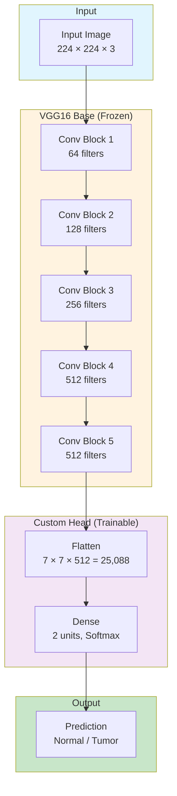

# VGG16 Kidney Disease Classification Model Architecture

## Model Overview



---

## Detailed Layer Structure

| Block | Layers | Output Shape | Parameters |
|-------|--------|--------------|------------|
| **Input** | InputLayer | (224, 224, 3) | 0 |
| **Block 1** | Conv2D × 2 + MaxPool | (112, 112, 64) | 38,720 |
| **Block 2** | Conv2D × 2 + MaxPool | (56, 56, 128) | 221,440 |
| **Block 3** | Conv2D × 3 + MaxPool | (28, 28, 256) | 1,475,328 |
| **Block 4** | Conv2D × 3 + MaxPool | (14, 14, 512) | 5,899,776 |
| **Block 5** | Conv2D × 3 + MaxPool | (7, 7, 512) | 5,899,776 |
| **Flatten** | Flatten | (25088,) | 0 |
| **Dense** | Dense + Softmax | (2,) | 50,178 |

---

## Model Summary

| Property | Value |
|----------|-------|
| **Base Model** | VGG16 (ImageNet pretrained) |
| **Total Parameters** | ~14.7 Million |
| **Trainable Parameters** | 50,178 (Dense layer only) |
| **Frozen Parameters** | ~14.7 Million (VGG16 base) |
| **Input Size** | 224 × 224 × 3 |
| **Output Classes** | 2 (Normal, Tumor) |
| **Optimizer** | SGD (lr=0.001) |
| **Loss Function** | Categorical Crossentropy |

---

## Data Flow

```
CT Scan Image (224×224×3)
         ↓
   VGG16 Feature Extractor (Frozen)
         ↓
   Feature Map (7×7×512)
         ↓
   Flatten (25,088 features)
         ↓
   Dense Layer (2 neurons)
         ↓
   Softmax Activation
         ↓
   [Normal: 0.92, Tumor: 0.08]
```
